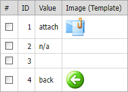

<!-- default badges list -->

[](https://supportcenter.devexpress.com/ticket/details/E1967)
[](https://docs.devexpress.com/GeneralInformation/403183)
<!-- default badges end -->

# Grid View for ASP.NET Web Forms - How to display an image in a grid cell
<!-- run online -->
**[[Run Online]](https://codecentral.devexpress.com/128539304/)**
<!-- run online end -->

This example demonstrates how to load an image into a cell based on another cell value.



## Implementation Details

The `Image` column declares a [DataItemTemplate](https://docs.devexpress.com/AspNet/DevExpress.Web.GridViewDataColumn.DataItemTemplate) that contains the `img` element.

```
<dx:GridViewDataColumn Caption="Image (Template)" >
    <DataItemTemplate>
        ' />
    </DataItemTemplate>
</dx:GridViewDataColumn>
```
An image URL is determined based on the row value in the `Value` column.

```
protected string GetImageName(object dataValue) {
    string val = string.Empty;
    try {
        val = (string)dataValue;
    } catch { }

    switch(val) {
        case "attach":
            return "~/Images/attach32x32.png";
        case "back":
            return "~/Images/back32x32.png";
        default:
            return "~/Images/1x1.gif";
    }
}
```

## Files to Review

* [Default.aspx](./CS/WebSite/Default.aspx) (VB: [Default.aspx](./VB/WebSite/Default.aspx))
* [Default.aspx.cs](./CS/WebSite/Default.aspx.cs) (VB: [Default.aspx.vb](./VB/WebSite/Default.aspx.vb))

## More Examples

* [Grid View for ASP.NET Web Forms - How to display an image in a grid's column](https://github.com/DevExpress-Examples/asp-net-web-forms-grid-display-image)
